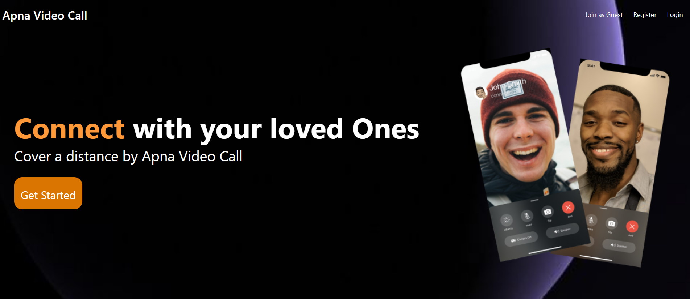
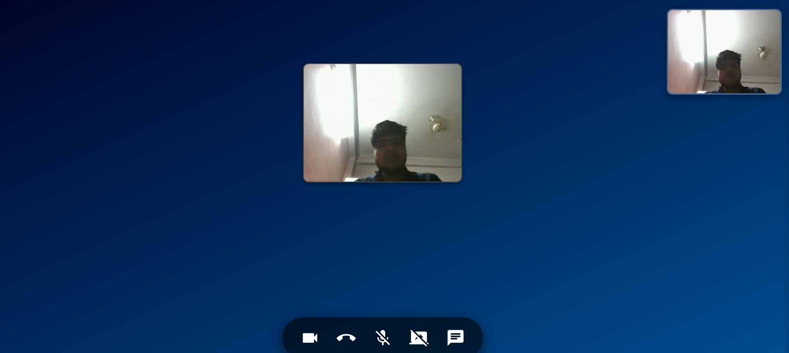
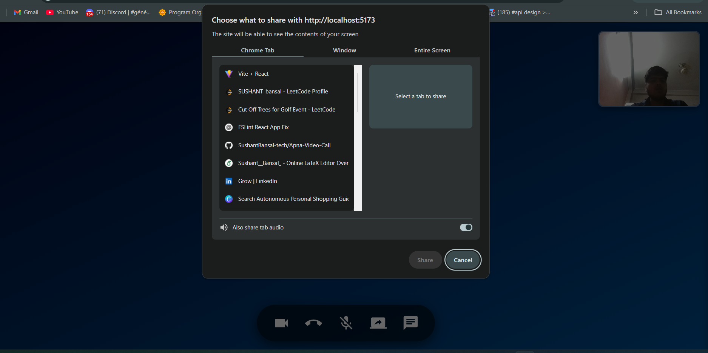

# 🌟 Apna Video Call 

---

## ✨ Overview

This project is a **sophisticated real-time communication and collaboration platform** built with the **MERN stack**, leveraging **WebRTC** for peer-to-peer video/audio streams, **WebSockets** for efficient bidirectional data transfer, and **Socket.IO** for robust real-time event handling. It's designed to facilitate seamless, low-latency interactions, showcasing a deep understanding of modern web technologies for complex distributed systems.

---

## 🚀 Features

* **Real-time Video & Audio Communication:** Seamless peer-to-peer live streaming using WebRTC for low-latency, high-quality audio and video transmission.
* **Instant Messaging & Chat:** Integrated real-time text chat alongside video calls, powered by WebSockets and Socket.IO for immediate message delivery.
* **Dynamic Room Management:** Users can create, join, and manage unique communication rooms, demonstrating robust state management and server-side logic.
* **Scalable Architecture:** Designed with a focus on scalability, utilizing WebSockets for efficient signaling and MERN for a modular, extendable backend.
* **Robust Event Handling:** Implements comprehensive event-driven communication using Socket.IO for connection management, disconnections, and various real-time interactions.
* **User-Friendly Interface:** Intuitive and responsive front-end built with React.js, providing an engaging user experience across devices.

---

## 💻 Technologies Used

* **MERN Stack:**
    * **MongoDB:** NoSQL database for flexible and scalable data storage.
    * **Express.js:** Fast, unopinionated, minimalist web framework for Node.js.
    * **React.js:** Declarative, component-based JavaScript library for building dynamic user interfaces.
    * **Node.js:** JavaScript runtime for building scalable server-side applications.
* **Real-time Communication:**
    * **WebRTC:** Web Real-Time Communication API for direct peer-to-peer audio and video streaming.
    * **WebSockets:** Full-duplex communication protocol over a single TCP connection for persistent, low-latency data exchange.
    * **Socket.IO:** A powerful library built on WebSockets for simplified real-time, event-based communication across various environments.

---

## ⚙️ Architecture

This application employs a modern full-stack architecture:

* **Frontend (React.js):** Manages the user interface, leverages WebRTC APIs for media capture and display, and communicates with the backend via Socket.IO for signaling and chat.
* **Backend (Node.js/Express.js):** Handles API requests, database interactions (MongoDB), and serves as the Socket.IO signaling server for WebRTC peer discovery and connection establishment.
* **Real-time Layer (WebSockets/Socket.IO):** Facilitates instantaneous, bidirectional communication for signaling WebRTC connections (e.g., exchanging SDP offers/answers, ICE candidates) and managing the real-time chat functionality.
* **Database (MongoDB):** Stores user data, chat history, and room information, ensuring persistence across sessions.

---

## 🛠️ Installation & Setup

To run this project locally, follow these steps:

1.  **Clone the repository:**
    ```bash
    git clone <your-repository-url>
    cd <project-folder>
    ```

2.  **Install dependencies for the backend:**
    ```bash
    cd backend
    npm install
    ```

3.  **Install dependencies for the frontend:**
    ```bash
    cd ../frontUI
    npm install
    ```

4.  **Start the backend server:**
    ```bash
    cd backend
    npm start
    ```

5.  **Start the frontend development server:**
    ```bash
    cd ../frontend
    npm start
    ```

6.  Open your browser and navigate to `http://localhost:3000` (or whatever port your frontend is running on).

---


## 📸 Screenshots

### 🔵 Landing Page


### 🎥 Video Call Interface


### 🖥️ Screen Sharing in Action



---

## 📄 License

This project is licensed under the [**MIT License**](https://opensource.org/licenses/MIT).